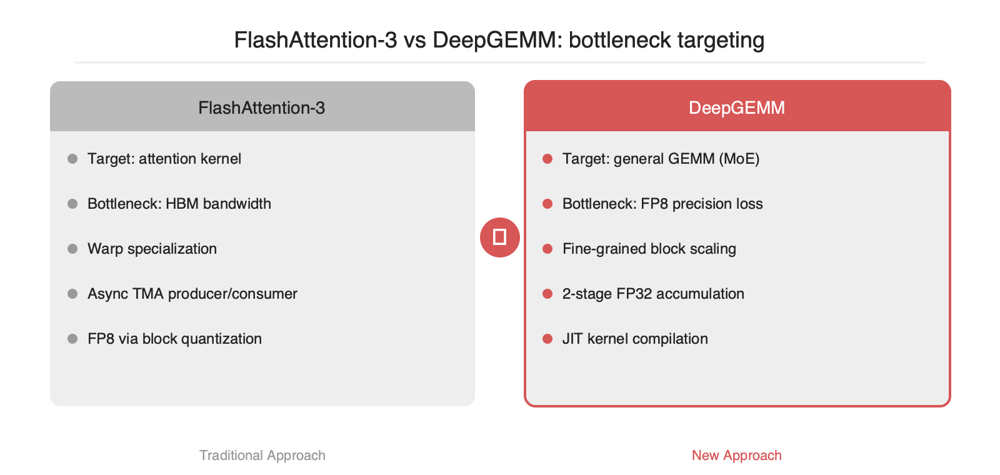
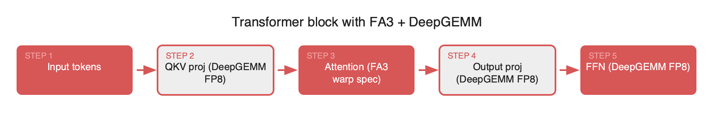

# FlashAttention-3 vs DeepGEMM: H100 메모리 최적화, 두 갈래의 접근법

2026-04-19

## Summary

H100 세대의 모델 서빙 최적화는 크게 두 갈래로 나뉩니다. FlashAttention-3는 어텐션의 O(N²) 메모리 폭발을 IO-aware 타일링과 warp specialization으로 해결하고, DeepGEMM은 FP8 GEMM의 수치 손실을 fine-grained scaling과 2단계 FP32 누산으로 복구합니다. 둘 다 wgmma와 TMA 같은 Hopper 전용 명령어를 사용하지만 공략 지점은 정반대입니다. 전자는 HBM↔SRAM 대역폭을, 후자는 FP8 정밀도 손실을 공격합니다. 서빙 스택에서는 경쟁 관계가 아니라 보완 관계이며, 어텐션은 FA3, QKV·FFN GEMM은 DeepGEMM으로 교차 배치하는 조합이 자연스럽습니다.

## 본문

### 병목이 다르다: 어텐션 vs GEMM

H100 세대의 LLM 서빙에서 GPU time을 차지하는 지점은 크게 두 군데입니다. 첫째는 어텐션의 O(N²) 메모리 폭발입니다. 시퀀스 길이가 32K, 64K로 늘어나면 N×N attention matrix를 HBM에 그대로 올리는 것만으로도 대역폭 예산을 모두 소모합니다. 둘째는 GEMM의 정밀도-throughput 트레이드오프입니다. MoE 구조에서 FFN·router GEMM은 토큰마다 빈번하게 호출되며, BF16은 throughput이 부족하고 FP8은 정확도 손실이 발생합니다.

FlashAttention-3와 DeepGEMM은 모두 H100(sm_90a)의 `wgmma`(Warp-Group MMA)와 `TMA`(Tensor Memory Accelerator)를 적극 활용합니다. 공통 기반이지만, 두 라이브러리가 이 명령어들을 쓰는 **전략**은 정확히 반대 방향을 향합니다. 전자는 메모리 이동을 숨기는 데 집중하고, 후자는 FP8 수치를 보존하는 데 집중합니다.

### FlashAttention-3: warp specialization으로 I/O를 숨긴다

FlashAttention-3(2024, Dao et al.)은 어텐션의 IO-aware 타일링을 H100용으로 재설계한 버전입니다. FA2가 단일 warp 안에서 `load → compute → store`를 순차 실행했다면, FA3는 warp를 **producer**와 **consumer**로 분할합니다.

- **Producer warpgroup**: TMA로 HBM에서 Q·K·V tile을 shared memory로 비동기 로드합니다.
- **Consumer warpgroup**: 로드된 tile에 대해 `wgmma`로 QKᵀ·AV matmul을 수행하고, 사이사이 CUDA core로 softmax를 계산합니다.

두 그룹이 서로 다른 파이프라인 스테이지에서 동시에 동작하므로, HBM 왕복 지연이 compute 시간과 거의 완전히 겹칩니다. FA2에서 직렬화되어 있던 I/O 버블이 사라지는 구조입니다.

여기에 FP8 경로에서는 softmax의 dynamic range 문제를 **block-wise quantization**과 **non-coherent transform**(학습에서 가져온 Hadamard-like rotation)으로 완화하여, outlier가 스케일을 왜곡하는 것을 방지합니다. 논문 실측치 기준 H100 SXM에서 BF16 어텐션은 약 740 TFLOPs(이론 peak의 약 75%), FP8은 약 1.2 PFLOPs에 도달합니다. FA2가 H100의 약 35%만 활용하던 것과 비교하면, 하드웨어 활용률이 약 2배로 증가합니다.

### DeepGEMM: fine-grained scaling으로 FP8을 살린다

DeepGEMM(2025, DeepSeek)은 접근 자체가 다릅니다. 타깃은 어텐션이 아니라 **일반 GEMM**, 특히 MoE FFN의 grouped matmul입니다. 여기서 가장 큰 페인포인트는 FP8의 수치 손실입니다. 텐서 전체를 단일 scale로 양자화하면 outlier 하나가 scale을 넓혀 나머지 값의 유효 bit를 잠식합니다.

DeepGEMM의 해법은 **fine-grained scaling**입니다.

- Activation은 `1×128` 블록 단위로, weight는 `128×128` 블록 단위로 각자의 FP8 scale을 가집니다.
- `wgmma`의 FP8 accumulate 결과를 일정 주기마다 FP32 누산기로 내려 **2단계 accumulation**을 수행합니다.
- 이로써 블록 간 dynamic range 차이가 누적 손실로 전파되지 않습니다.

또 한 가지 설계 포인트는 **JIT compilation**입니다. 커널을 미리 빌드된 바이너리로 배포하지 않고, `M/N/K`와 MoE 그룹 크기를 런타임에 확인해 Ninja로 빌드합니다. 이로써 코어 구현은 수백 줄 수준으로 작고, shape 특화 최적화가 자연스럽게 반영됩니다. DeepSeek이 공개한 벤치마크 기준, H800에서 FP8 GEMM이 약 1550 TFLOPs에 도달하여 cuBLAS 기반 FP8 경로 대비 약 1.5~2배 수준의 throughput을 보입니다(H800은 sm_90a로 H100과 동일한 Tensor Core 구성을 가지며, 차이는 주로 NVLink 대역폭에 있습니다). 최근 릴리스에서는 SM100(Blackwell) 경로도 추가되었습니다.

### 공략 포인트 한 줄 요약

두 라이브러리의 공략 지점을 요약하면 다음과 같습니다.

- **FA3**: `HBM ↔ SRAM 대역폭`을 warp specialization과 async TMA로 **은닉**합니다.
- **DeepGEMM**: `FP8 양자화 손실`을 블록 단위 scale과 FP32 두 단계 누산으로 **복구**합니다.

양쪽 모두 `wgmma`를 사용하지만, FA3는 이 명령어를 **latency hiding** 도구로, DeepGEMM은 **precision-preserving** 연산 단위로 활용합니다.

### 서빙 스택에서의 조합

실무에서 두 라이브러리는 경쟁 관계가 아니라 보완 관계입니다. Transformer 한 블록 내부를 보면 다음과 같은 배치가 가능합니다.

```
Input  →  QKV Projection (GEMM)  →  Attention  →  Output Projection (GEMM)  →  FFN (GEMM)
              ↑                          ↑                    ↑                     ↑
          DeepGEMM FP8               FA3 kernel          DeepGEMM FP8          DeepGEMM FP8
```

어텐션 블록은 FA3로, 앞뒤의 projection과 FFN GEMM은 DeepGEMM으로 배치하면 서빙 경로 전반에서 서로 다른 병목이 분산됩니다. vLLM의 custom attention backend나 SGLang의 kernel registry에 이 조합을 endpoint 단위로 통합하는 PR이 최근 증가하고 있습니다.

실제 서빙 코드 상에서는 대략 다음과 같은 형태가 됩니다.

```python
# 의사 코드: Hopper 전용 분기에서 FA3 + DeepGEMM 활성화
from flash_attn_interface import flash_attn_func  # FA3 경로
import deep_gemm

def hopper_forward(x, qkv_w, out_w, ffn_w, scales):
    # 1) QKV projection — DeepGEMM FP8 GEMM (fine-grained scaling)
    qkv = deep_gemm.gemm_fp8_fp8_bf16_nt(
        x, qkv_w, scales.x, scales.qkv_w          # 1×128 / 128×128 scales
    )
    q, k, v = qkv.chunk(3, dim=-1)

    # 2) Attention — FlashAttention-3 kernel (warp specialization + TMA)
    o = flash_attn_func(q, k, v, causal=True, softmax_scale=scale)

    # 3) Output + FFN — 다시 DeepGEMM으로 FP8 GEMM
    o = deep_gemm.gemm_fp8_fp8_bf16_nt(o, out_w, scales.o, scales.out_w)
    return deep_gemm.gemm_fp8_fp8_bf16_nt(o, ffn_w, scales.post_attn, scales.ffn_w)
```

실제 vLLM PR을 보면 이 스위칭을 `torch.cuda.get_device_capability() == (9, 0)` 조건 아래에서 분기하고, Ampere 이하에서는 기존 FA2 + cuBLAS 경로로 fallback하는 방식을 사용합니다.








### 도입 시 체크리스트

1. **Hopper 한정**: 두 라이브러리 모두 `sm_90a`의 `wgmma`·`TMA`에 하드 의존합니다. A100(sm_80)이나 그 이전 세대에서는 동작하지 않으므로 기존 FA2 + cuBLAS 경로를 그대로 유지해야 합니다.
2. **FP8 정확도 교차 검증**: DeepGEMM의 fine-grained scaling을 사용하더라도 PPL이 미세하게 변동할 수 있습니다. 특히 RLHF로 튜닝된 모델은 활성 분포가 민감하므로, downstream eval(MT-Bench, HumanEval 등)로 반드시 교차 확인이 필요합니다.
3. **JIT warm-up**: DeepGEMM은 첫 호출 시 Ninja 컴파일로 shape당 수 초(관찰 범위 5~15초) 지연이 발생합니다. 서빙 시작 직후 대표 shape 세트에 대한 warm-up GEMM 루프를 한 번 실행하지 않으면 p99 latency가 악화됩니다.
4. **MoE 특화 여부**: DeepGEMM의 grouped GEMM 최적화는 MoE를 전제로 합니다. Mistral 7B 같은 dense 모델에서는 이점이 감소하므로 cuBLAS FP8·Transformer Engine과 실측 비교가 필요합니다.
5. **TE와의 역할 분담**: NVIDIA Transformer Engine(TE)도 FP8 GEMM을 제공하지만 scaling granularity는 텐서 단위에 가깝습니다. MoE·long-context 워크로드에서는 DeepGEMM의 블록 단위 scaling이 유리한 편이며, dense·표준 transformer에서는 TE가 더 안정적인 선택지로 판단됩니다.

### 정리

H100의 FP8 이론 peak(SXM5 기준 약 1979 TFLOPs)는 실사용에서 도달하기 어렵습니다. FA3와 DeepGEMM은 이 peak에 접근하는 두 가지 서로 다른 경로입니다. 한쪽은 **메모리 이동을 은닉**하고, 다른 한쪽은 **수치 정밀도를 보존**하는 방식을 취합니다. 서빙 엔지니어 입장에서 둘 중 하나만 선택하는 것은 올바른 질문이 아닙니다. 두 경로는 동일한 목표(이론 peak 활용률 극대화)를 향합니다.

## References

- [https://github.com/Dao-AILab/flash-attention](https://github.com/Dao-AILab/flash-attention)
