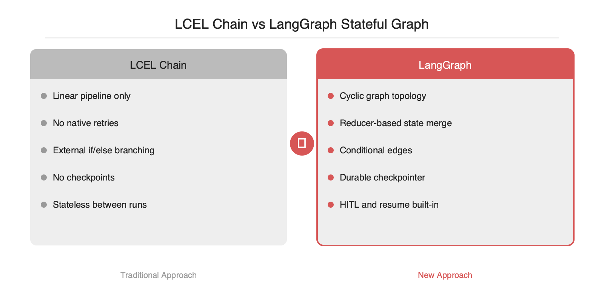
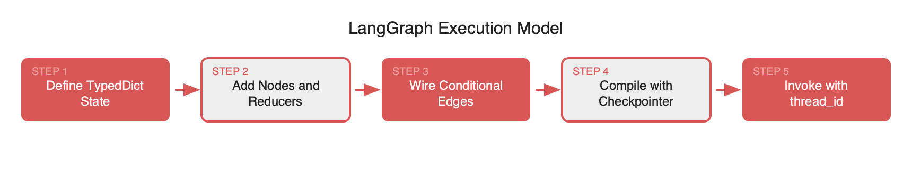

# 단방향 체인을 넘어: LangGraph 1.1로 보는 순환 워크플로우와 상태 관리 실전

2026-04-19

## Summary

LCEL의 단방향 체인은 분기·재시도·HITL 같은 실무 에이전트 패턴을 표현하기 어렵습니다. 2025년 10월 GA된 LangGraph 1.0과 2026년 4월 공개된 1.1.8(29.6k★)은 Pregel/NetworkX 기반 그래프 위에 StateGraph·Reducer·Checkpointer를 구성하여 순환형 에이전트를 표준화합니다. 2026년 1월 도입된 StateSchema는 Zod·Pydantic 등 Standard Schema 라이브러리를 혼용할 수 있게 하였고, UntrackedValue·ReducedValue는 체크포인트에 포함할 상태와 런타임 전용 상태를 타입 레벨에서 분리합니다. 이 글은 StateGraph·Annotated reducer·conditional_edges·checkpoint 네 개 축을 중심으로 LangGraph의 설계 철학과 실무 도입 시 발생하는 함정을 정리합니다.

## 본문

### 문제: 단방향 체인의 한계

LCEL(LangChain Expression Language) 체인은 `prompt | model | parser` 같은 파이프라인을 간결하게 표현합니다. 다만 실무 에이전트에 투입하면 세 지점에서 한계가 드러납니다.

- **조건 분기**: tool call 결과에 따라 다음 단계를 바꾸려면 체인 외부에서 `if`를 강제로 삽입해야 합니다.
- **재시도/루프**: RAG의 rerank → reflection → retry, ReAct의 thought-action-observation 루프 같은 순환 패턴이 표현되지 않습니다.
- **중간 인터럽트**: HITL 승인 단계에서 상태를 영속화하고 재개하는 로직이 제공되지 않습니다.

LangGraph는 이 세 가지를 **그래프 + 상태 + 체크포인터** 세 축으로 해결합니다. 실행 모델은 Pregel/Apache Beam에서, 공개 API는 NetworkX에서 가져왔다고 공식 README가 명시합니다.

### StateGraph · Reducer · Conditional Edge

LangGraph의 기본 단위는 `StateGraph`입니다. `TypedDict`로 상태를 정의하고, 각 키에 **reducer**를 `Annotated`로 지정합니다. 여러 노드가 같은 키를 동시에 업데이트할 때 merge 전략을 선언형으로 지정하는 장치입니다.

```python
from typing import Annotated, TypedDict
from langgraph.graph import StateGraph, START, END
from operator import add

class AgentState(TypedDict):
    messages: Annotated[list, add]   # 누적 (reducer = add)
    retries: int                     # 덮어쓰기 (reducer 생략 = 기본 replace)

def retrieve(state): ...
def grade(state): ...
def generate(state): ...

g = StateGraph(AgentState)
g.add_node("retrieve", retrieve)
g.add_node("grade", grade)
g.add_node("generate", generate)

g.add_edge(START, "retrieve")
g.add_edge("retrieve", "grade")
g.add_conditional_edges(
    "grade",
    lambda s: "generate" if s["retries"] >= 2 or grade_ok(s) else "retrieve",
    {"retrieve": "retrieve", "generate": "generate"},
)
g.add_edge("generate", END)

app = g.compile()
```

핵심은 `add_conditional_edges`의 두 번째 인자입니다. 상태를 받아 다음 노드 이름을 반환하는 **순수 함수**로 retry·fallback·early-exit 세 가지 패턴을 한 번에 표현합니다. 이 함수를 순수 함수로 유지해야 체크포인트 재개 시 결정적으로 재현됩니다. 실무에서 자주 누락되는 지점입니다.





### Durable Execution: 체크포인터 한 줄의 효과

LangGraph 1.0(2025-10 GA)의 핵심 셀링 포인트는 **durable execution**입니다. `.compile(checkpointer=...)` 한 줄로 매 스텝마다 상태 스냅샷이 저장되고, `thread_id` 단위로 중단·재개가 가능합니다.

```python
from langgraph.checkpoint.sqlite import SqliteSaver

app = g.compile(
    checkpointer=SqliteSaver.from_conn_string("checkpoints.db")
)
config = {"configurable": {"thread_id": "user-42"}}

app.invoke({"messages": [("user", "help me")]}, config)
# 서버 재시작, 머신 크래시, 다음 날 아침
app.invoke(None, config)   # 중단된 노드부터 재개
```

멀티데이 승인 워크플로우, 백그라운드 job, 에이전트 장애 복구처럼 기존에 Temporal·Airflow 같은 워크플로우 엔진을 별도 운영해야 했던 케이스를 프레임워크 내부에서 처리합니다. 1.1 라인은 `AsyncSqliteSaver`, `AsyncPostgresSaver` 같은 비동기 체크포인터도 함께 제공하여 고빈도 tool 루프에서도 사용 가능합니다.





### 2026 업데이트: StateSchema와 새 Value 타입

1.1.x(2025-12~2026-04, 최신 1.1.8)는 실무에서 불편했던 지점들을 직접 해결합니다.

- **StateSchema** (2026-01): Standard Schema 호환 라이브러리(Zod 4, Pydantic, Valibot, ArkType 등)로 상태를 선언할 수 있습니다. 기존 `TypedDict`보다 런타임 검증·직렬화·JSON 스키마 export가 자연스럽습니다.
- **ReducedValue**: reducer의 입력 타입과 출력 타입을 분리하여 타입 힌트가 실제 동작과 일치하게 합니다.
- **UntrackedValue**: DB 커넥션, 캐시, 파일 핸들처럼 **체크포인트에 포함하면 안 되는 런타임 전용 상태**를 타입 레벨에서 배제합니다. 직렬화 불가능 객체를 상태에 포함시켜 체크포인트가 실패하는 고전적 버그를 구조적으로 차단합니다.
- **프로덕션 미들웨어**: 모델 재시도(지수 백오프), 콘텐츠 모더레이션 등이 내장되었습니다.

### 도입 시 트레이드오프

- **장점**: HITL·재시도·재개가 내장되어 별도 워크플로우 엔진 없이 장시간 에이전트를 운영할 수 있습니다.
- **장점**: LangSmith와 연동하면 노드별 레이턴시·상태 전이를 바로 추적할 수 있습니다.
- **단점**: 체크포인터 I/O가 레이턴시 병목이 되는 케이스가 존재합니다. 고빈도 tool 루프에서는 in-memory saver나 async saver로 튜닝이 필요합니다.
- **단점**: 단순 요약·번역·문서 Q&A 같은 단방향 파이프라인에는 과설계입니다. 이 경우 LCEL이 더 가볍고 빠릅니다.

요컨대 LangGraph는 "에이전트"를 **그래프 알고리즘**으로 환원하여 설계·디버그·재개 가능한 객체로 변환한 프레임워크입니다. 순환형 워크플로우를 명시적으로 기술할 수 있는 도구가 필요하다면, 2026년 현재 프로덕션에서 검증된 선택지로 판단됩니다.

## References

- [https://github.com/langchain-ai/langgraph](https://github.com/langchain-ai/langgraph)
