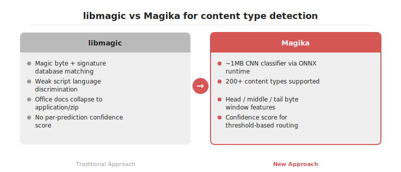

# Magika: libmagic의 오탐을 걷어내는 1MB CNN 기반 파일 타입 검출기

2026-04-19

## Summary

Magika는 Google이 공개한 딥러닝 기반 파일 콘텐츠 타입 검출기입니다. libmagic이 의존하는 시그니처 매칭은 확장자 위조·스크립트 언어 구분·ZIP 컨테이너 기반 Office 포맷 판정에서 오탐이 잦아 업로드 파이프라인과 RAG 전처리, DLP 스캐닝의 신뢰도를 낮춰 왔습니다. Magika는 1MB 수준의 CNN 분류기로 200여 종의 콘텐츠 타입을 밀리초 단위로 판정하며, 동일 벤치마크에서 libmagic 대비 전반적 정확도를 끌어올립니다. 본 글은 내부 구조, 파이썬 통합 패턴, 도입 시 검증 포인트를 정리합니다.

## 본문

### libmagic 기반 검출이 만들던 실무 페인포인트

libmagic은 `/usr/share/file/magic` 시그니처 데이터베이스를 순차 매칭하며, 확장자 신호와 결합해 MIME 타입을 판정합니다. 실무에서는 세 가지 문제가 반복됩니다. 첫째, 확장자와 매직 바이트가 모두 모호한 스크립트 계열(Python, JavaScript, TypeScript, Ruby, Shell)은 단순 휴리스틱으로 구분하기 어려워 다수가 `text/plain` 으로 수렴합니다. 둘째, Office 계열 문서(docx, xlsx, pptx)는 내부 구조가 ZIP 컨테이너이므로 같은 매직 바이트 `PK\x03\x04` 를 공유하며, 확장자가 제거되거나 위조되면 `application/zip` 으로 분류됩니다. 셋째, 악성 페이로드가 헤더만 위조한 경우 시그니처 기반 판정이 속기 쉽습니다. 업로드 게이트·RAG 파서 라우팅·DLP 스캐닝처럼 다운스트림이 타입 판정에 의존하는 구조에서는 이러한 오탐이 파이프라인 전체로 전파됩니다.





### Magika의 구조와 학습 데이터

Magika는 수억 건 규모의 파일 코퍼스로 학습된 소형 CNN 분류기입니다. 공개된 모델은 ONNX 포맷으로 배포되며 1MB 수준이며, 추론은 `onnxruntime` 으로 수행됩니다. 입력은 파일의 앞·가운데·뒤 영역에서 추출한 고정 길이 바이트 블록이며, 출력은 200여 개 콘텐츠 타입에 대한 확률 분포입니다. 단일 코어 CPU 기준 추론 시간은 파일당 수 밀리초 수준으로 보고되며, 배치 처리 시 파일당 오버헤드는 더 낮아집니다. 결과에는 MIME 타입, 그룹(text, document, executable 등), 설명, 확률 점수가 함께 반환되므로 임계값 기반 라우팅에 직접 활용할 수 있습니다.

### 파이썬 API 통합 예시

```python
from magika import Magika

m = Magika()
res = m.identify_path("/uploads/unknown.bin")
print(res.output.ct_label, res.output.mime_type, res.output.score)

# 메모리 버퍼에 대해서도 동일한 추론이 가능합니다.
with open("/uploads/unknown.bin", "rb") as f:
    res2 = m.identify_bytes(f.read())
```

`identify_bytes` 는 디스크에 쓰기 전 단계에서 판정이 필요한 FastAPI·Django 업로드 핸들러에 적합합니다. 모델은 프로세스당 한 번 로드되므로 이후 호출은 순수 텐서 연산이며 I/O 병목이 없습니다.


### 실무 도입 시 고려사항

정확도 향상이 분명한 영역은 스크립트·소스코드 구분과 Office 계열 세부 분류입니다. 단순 이미지·비디오처럼 매직 바이트가 강한 전통 바이너리 포맷에서는 libmagic과의 격차가 크지 않습니다. 따라서 전면 교체보다는 보강 전략이 현실적이며, `score` 가 임계값 아래일 때만 libmagic 을 폴백으로 두는 2단계 라우팅이 권장됩니다. 학습 데이터 분포에 포함되지 않은 자사 고유 포맷은 정확히 분류되지 않으므로, 내부 포맷용 룰은 별도로 유지해야 합니다. 모델 크기는 컨테이너 이미지에 무시할 수준의 비용이지만, 콜드스타트가 민감한 서버리스 환경에서는 `onnxruntime` 초기화 오버헤드를 측정한 뒤 워커 상주 모델을 선택하는 편이 안전합니다.

### 정리

Magika는 libmagic 이 약했던 텍스트 계열·압축 컨테이너 식별 지점을 1MB 수준의 CNN 으로 보강하는 구체적 도구입니다. 전면 교체보다는 confidence 기반 2단계 파이프라인으로 배치하는 접근이 오탐 회피와 성능 안정성 양쪽 모두에서 안전하다고 판단됩니다.

## References

- [https://github.com/google/magika](https://github.com/google/magika)
