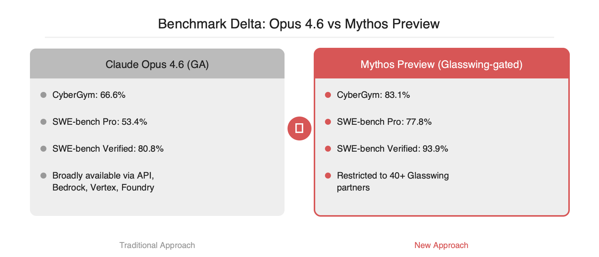

# Project Glasswing: Mythos Preview 가 드러낸 LLM 보안 감사의 임계점

2026-04-19

## Summary

Anthropic 이 4월 7일 공개한 Project Glasswing 은 AWS·Apple·Google·Microsoft·NVIDIA 등 12개 launch partner 와 40여 기관이 참여하는 핵심 소프트웨어 보안 컨소시엄입니다. 아직 정식 공개되지 않은 Claude Mythos Preview 모델에 100M 달러 상당 크레딧을 얹어 OS·브라우저·FFmpeg 등의 제로데이를 자동 탐지하고 exploit 후보까지 자율적으로 구성합니다. 실측 결과로 27년 묵은 OpenBSD 취약점, 16년 묵은 FFmpeg 취약점을 포함한 수천 건의 제로데이가 발견됐고 Linux 커널 권한 상승 체인도 자율적으로 조합됐습니다. CyberGym 83.1% vs Opus 4.6 의 66.6%, SWE-bench Verified 93.9% vs 80.8% 로 역량 격차가 확인되며, Mythos 는 공개 대신 게이팅된 접근 경로만 제공합니다.

## 본문

Anthropic 이 4월 7일 홈페이지에서 공개한 Project Glasswing 의 핵심 팩트는 두 가지입니다. 첫째, 아직 정식 공개되지 않은 Claude Mythos Preview 모델이 수천 건 규모의 제로데이를 자율적으로 찾아냈다고 보고됐으며, 그중에는 OpenBSD 의 27년 묵은 버그와 FFmpeg 의 16년 묵은 버그가 포함됩니다. 둘째, 같은 모델이 Linux 커널 취약점 여러 개를 체이닝해 권한 상승까지 수행했습니다. 이는 LLM 이 단일 버그 힌트를 받아 재현하는 수준을 넘어 CVE 급 결함을 독립적으로 구성하기 시작했다는 신호로 판단됩니다.

### 벤치마크로 본 Mythos Preview 와 Opus 4.6 의 역량 격차

Glasswing 이 공개한 벤치마크는 모두 Claude Opus 4.6 기준 대비 Mythos Preview 의 수치입니다. 보안 취약점 재현 평가인 Cybersecurity Vulnerability Reproduction(CyberGym) 에서 Mythos 는 83.1% 를 기록했고 Opus 4.6 은 66.6% 였습니다. 소프트웨어 엔지니어링 벤치 SWE-bench Pro 는 77.8% vs 53.4%, SWE-bench Verified 는 93.9% vs 80.8% 입니다. 취약점 재현 쪽보다 패치 작성이 얽힌 SWE-bench Pro 의 격차(+24.4%p)가 더 크다는 점이 눈에 띕니다. 결함 탐지와 exploit-또는-patch 생성이 동일한 모델 안에서 연결되는 구조가 성능 향상의 주된 원천으로 보입니다.

### 게이팅된 배포 — Mythos 는 왜 GA 가 아닌가

같은 날 Opus 4.7 릴리스 노트는 "Opus 4.7 은 우리가 보유한 가장 강력한 모델인 Claude Mythos Preview 보다 의도적으로 덜 broadly-capable 합니다" 라고 명시합니다. Glasswing 이 Mythos 를 40여 파트너에게만 노출하는 근거도 동일한 맥락으로 해석됩니다. 공격자에게 유사한 역량이 이식되기 전에 오픈소스 핵심 인프라 쪽 패치를 선행시키려는 설계입니다. 파트너 접근은 Claude API, Amazon Bedrock, Google Cloud Vertex AI, Microsoft Foundry 로 한정되며 프리뷰 이후의 공식 가격은 입력 토큰 100만 개당 25달러, 출력 토큰 100만 개당 125달러로 고지됐습니다. Opus 4.7 의 5달러/25달러 가격대와 비교하면 5배 수준입니다.

### 실무 관점의 시사점 세 가지

첫째, 오픈소스 핵심 인프라 유지보수팀은 "취약점 제보량 급증" 을 전제로 triage 파이프라인을 재설계해야 합니다. Anthropic 이 Alpha-Omega·OpenSSF 에 2.5M 달러, Apache Software Foundation 에 1.5M 달러 크레딧을 별도 배정한 것도 동일한 부담을 흡수하기 위함입니다. 둘째, 90일 뒤 공개될 Lessons Learned 리포트까지는 Glasswing 외부에서 Mythos 를 실행할 수 없으므로, 방어 측면에서는 우선 Opus 4.7 기반 SAST/DAST 파이프라인을 선행 구축해 두는 편이 현실적입니다. 셋째, Claude for Open Source 프로그램은 Mythos 와 별개로 OSS 유지보수자에게 Claude 크레딧을 지급하므로, 자체 패치 제안 에이전트를 CI 단계에 얹는 구조가 개별 프로젝트의 첫 도입 단계로 적합합니다.

### 공개된 정보의 한계

현 시점 공개 자료에는 Mythos Preview 의 파라미터 규모, 추론 비용 구조, 체이닝 루프의 상한 등이 명시되지 않았습니다. CyberGym·SWE-bench 수치가 동일 시드·동일 툴링에서 산출됐는지도 확인되지 않습니다. 90일 이후 Lessons Learned 공개 시점에 disclosed CVE 목록·제보 라이프사이클 지표·자동 패치 승인률 같은 후속 지표가 함께 공개돼야 이번 성과를 독립적으로 검증할 수 있습니다.

## References

- [https://www.anthropic.com/glasswing](https://www.anthropic.com/glasswing)
