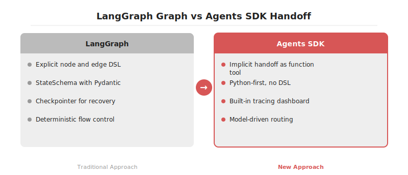
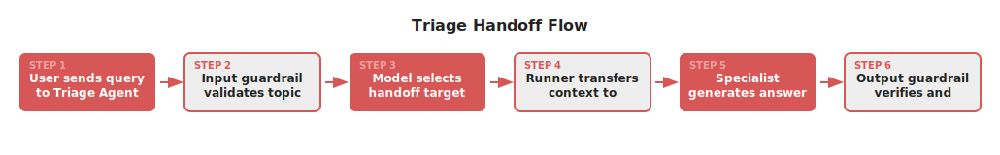

# Swarm을 넘어서: OpenAI Agents SDK의 handoff 중심 멀티에이전트 설계

2026-04-19

## Summary

OpenAI가 실험적 샘플 프로젝트였던 Swarm을 정리하고 프로덕션 지향 멀티에이전트 SDK인 openai-agents-python을 공개했습니다. 22.5K 스타를 확보한 이 프레임워크는 LangGraph의 상태 그래프 방식 대신 handoff라는 에이전트 간 제어 이전 메커니즘을 제1 원시 연산으로 채택합니다. Agent, Runner, Handoff, Guardrail 네 가지 프리미티브만으로 오케스트레이션을 기술하며 트레이싱과 함수 도구 자동 래핑이 기본 탑재됩니다. 모델 판단에 흐름을 위임해 코드가 간결해지지만 명시적 엣지가 없어 회귀 테스트 설계는 별도 노력이 필요합니다.

## 본문

### Swarm의 한계와 SDK 재정비

2024년 10월 공개된 Swarm은 교육용 레퍼런스에 가까운 프로젝트였습니다. MIT 라이선스로 자유롭게 사용 가능했지만 프로덕션 용도로 공식 권장되지 않았고, 관측성·가드레일·영속 상태 같은 실무 요건이 빠져 있었습니다. openai-agents-python은 그 경험을 정리해 Responses API 위에서 동작하는 정식 멀티에이전트 SDK로 재정비한 결과물로 판단됩니다. 저장소 기준 22.5K 스타는 이 설계 방향에 대한 시장의 반응을 보여줍니다.

### 네 가지 핵심 프리미티브

SDK는 네 개의 원시 연산만을 제공합니다. Agent는 지시문, 도구 목록, 모델 설정을 캡슐화한 객체입니다. Runner는 에이전트 루프를 실행하면서 도구 호출·응답·다음 스텝 결정을 관장합니다. Handoff는 한 에이전트가 다른 에이전트에게 제어를 넘기는 동작을 뜻합니다. Guardrail은 입출력에 대한 사전·사후 검증 함수이며 Pydantic 모델과 결합해 구조화된 실패 신호를 돌려줍니다.

```python
from agents import Agent, Runner, handoff

refund_agent = Agent(name="refund", instructions="환불 정책만 답합니다.")
billing_agent = Agent(name="billing", instructions="결제 질문만 답합니다.")
triage = Agent(
    name="triage",
    instructions="문의를 분류하고 적절한 에이전트에 handoff 합니다.",
    handoffs=[handoff(refund_agent), handoff(billing_agent)],
)
result = Runner.run_sync(triage, "지난주 결제 건 환불이 가능한가요?")
```








### handoff의 구현 원리

handoff는 내부적으로 함수 도구로 구현됩니다. 삼각 분류 에이전트의 도구 목록에 transfer_to_refund, transfer_to_billing 같은 자동 생성 함수가 추가되고, 모델이 해당 함수를 호출하면 Runner가 대화 상태와 함께 대상 에이전트로 제어를 넘깁니다. LangGraph처럼 명시적 엣지를 선언하지 않아 보일러플레이트가 줄어들지만, 라우팅 판단이 모델에 의존한다는 한계가 생깁니다. 라우팅 정확도를 보장하려면 지시문 설계와 guardrail 테스트에 품이 더 들어갑니다.

### 가드레일과 트레이싱

입력 가드레일은 첫 사용자 턴을 처리하기 전에 실행돼 허용되지 않는 주제를 조기에 차단합니다. 출력 가드레일은 최종 응답 직전에 실행되며 실패 시 OutputGuardrailTripwireTriggered 예외를 발생시켜 루프를 중단합니다. 트레이싱은 기본 활성화 상태이며 OpenAI 대시보드에서 에이전트 호출 트리, 도구 입·출력, 토큰 사용량을 단일 뷰로 확인할 수 있습니다. 외부 관측 도구와 연동하려면 `set_trace_processors` API로 OTLP exporter 등을 연결합니다.

### LangGraph와의 트레이드오프

LangGraph는 상태 그래프를 선언적으로 작성하고 체크포인터로 복구 지점을 관리합니다. 흐름이 명시적이어서 회귀 테스트가 쉽지만 코드량이 많고 StateSchema 설계에 초기 비용이 발생합니다. Agents SDK는 흐름을 모델 판단에 위임해 간결하지만 분기가 늘어날수록 관측·재현성 설계 비용이 증가합니다. 결정적 워크플로우와 감사 요구가 강하면 LangGraph, 대화형·개방형 분기가 주라면 Agents SDK가 더 자연스러운 선택지로 판단됩니다.

## References

- [https://github.com/openai/openai-agents-python](https://github.com/openai/openai-agents-python)
