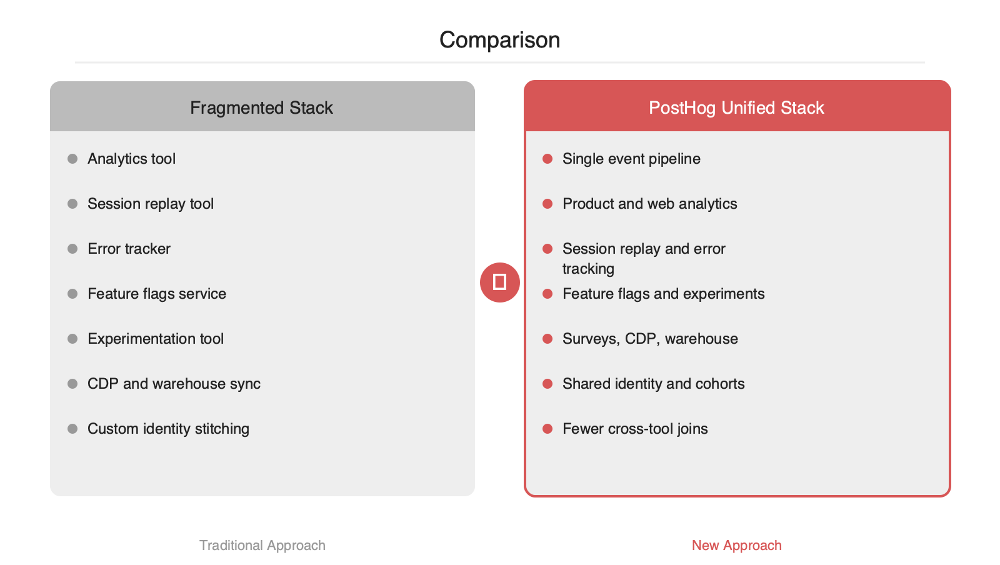

# AI 제품 운영 데이터를 한 스택으로 묶는 방법, PostHog

2026-04-26

## Summary

AI 제품을 출시한 뒤 어려운 지점은 모델 성능 자체보다 사용자 행동과 시스템 신호를 한 문맥에서 해석하는 일입니다. 클릭 이벤트는 분석 도구에, 에러는 APM에, 기능 노출은 플래그 시스템에, 사용자 속성은 CDP에 흩어지기 쉽습니다. PostHog는 이 분산을 줄이기 위해 이벤트 수집, 세션 리플레이, 에러 추적, 기능 플래그, 실험, 설문, 데이터 웨어하우스, CDP를 한 플랫폼으로 묶습니다. 지금 이 접근이 중요한 이유는 AI 제품이 프롬프트 버전, 모델 선택, 응답 지연, 실패 유형 같은 운영 메타데이터를 함께 분석해야만 실제 전환과 이탈 원인을 찾을 수 있기 때문입니다.

## 본문

### 문제 배경

AI 제품의 운영 데이터는 전통적인 웹 서비스보다 차원이 하나 더 많습니다. 단순 페이지뷰나 클릭 수만으로는 충분하지 않습니다. 어떤 모델을 호출했는지, 프롬프트 버전이 무엇인지, 응답 지연이 얼마였는지, 실패가 타임아웃인지 안전 정책 차단인지, 그 직전 사용자가 어떤 기능 플래그 집단에 속했는지까지 함께 봐야 합니다. 기존 방식은 이 신호를 분석 도구, 세션 리플레이, 에러 추적기, 기능 플래그 서비스, CDP, 웨어하우스에 나눠 저장하는 경우가 많습니다. 이 구조에서는 동일 사용자와 동일 세션을 기준으로 사건을 재구성하는 비용이 커집니다.

### PostHog의 접근 방식

PostHog는 이 문제를 `단일 이벤트 계층`으로 줄이려는 플랫폼입니다. 제품 분석, 웹 분석, 세션 리플레이, 에러 추적, 기능 플래그, 실험, 설문, 데이터 웨어하우스, CDP를 한 스택 안에서 연결합니다. 핵심은 기능별로 별도 도구를 붙이는 대신, 사용자 식별자와 이벤트 속성을 중심으로 모든 기능을 엮는 점입니다.

엔지니어 관점에서 보면 구조는 다음처럼 이해할 수 있습니다.

1. SDK 또는 서버 API가 이벤트를 수집합니다.
2. 이벤트는 사용자, 세션, 그룹, 속성 정보와 함께 저장됩니다.
3. 같은 데이터 위에서 퍼널, 리텐션, 코호트, 리플레이, 에러 상관분석, 플래그 실험을 수행합니다.
4. 필요하면 웨어하우스나 역방향 동기화 계층으로 데이터를 이동시켜 BI 또는 운영 시스템과 연결합니다.

이 모델의 장점은 AI 기능의 품질 신호를 제품 지표와 직접 연결할 수 있다는 점입니다. 예를 들어 `prompt_version=v12`가 적용된 사용자군에서 `report_generated` 전환율은 올랐지만 `retry_clicked`와 `latency_ms`도 함께 증가했다면, 모델 비용이나 지연과 전환의 균형을 같은 맥락에서 볼 수 있습니다.

### 기존 조합형 스택과의 차이

전통적인 조합형 스택은 목적별 전문 도구를 선택할 수 있다는 장점이 있습니다. 반면 운영 비용은 커집니다. 이벤트 스키마를 여러 곳에 맞춰 중복 설계해야 하고, 사용자 식별 체계가 조금만 어긋나도 분석 결과가 갈라집니다. PostHog는 이 결합 비용을 낮추는 쪽에 가깝습니다.

- 분석과 플래그가 같은 사용자 코호트를 공유합니다.
- 세션 리플레이와 에러를 같은 이벤트 타임라인에서 볼 수 있습니다.
- 실험 결과를 별도 ETL 없이 제품 이벤트와 연결하기 쉽습니다.
- 자체 호스팅 선택지가 있어 규제나 데이터 거버넌스 요구가 있는 조직에도 맞을 수 있습니다.

반대로 고려할 점도 있습니다.

- 올인원 플랫폼은 도입 초기 범위가 넓어 보일 수 있습니다.
- 기존에 전문 도구를 깊게 사용 중이라면 마이그레이션 비용이 발생합니다.
- 이벤트 설계를 대충 시작하면 도구가 하나여도 분석 품질은 낮아집니다.

### AI 제품에서의 실전 계측 포인트

AI 기능은 비즈니스 이벤트와 모델 운영 이벤트를 같이 심어야 합니다. 다음과 같은 속성이 유용합니다.

- `feature_name`, `entry_point`
- `model`, `prompt_version`, `temperature`
- `latency_ms`, `token_input`, `token_output`, `cost_estimate`
- `result_type`, `error_type`, `retry_count`
- `flag_variant`, `experiment_key`

```python
# server-side example
from posthog import Posthog

posthog = Posthog(project_api_key="<ph_project_key>", host="https://us.i.posthog.com")

posthog.capture(
    distinct_id="user_123",
    event="ai_response_generated",
    properties={
        "feature_name": "sql_copilot",
        "model": "gpt-4.1",
        "prompt_version": "v12",
        "latency_ms": 1840,
        "token_input": 1320,
        "token_output": 410,
        "result_type": "success",
        "workspace_id": "team_42"
    }
)
```

```javascript
// client-side flag check example
if (posthog.isFeatureEnabled('new-ai-onboarding')) {
  posthog.capture('onboarding_variant_seen', { variant: 'new-ai-onboarding' })
}
```

이렇게 계측하면 단순히 "누가 썼는가"를 넘어서 "어떤 모델·프롬프트·플래그 조합에서 전환과 이탈이 갈렸는가"를 볼 수 있습니다.





### 도입 판단 포인트

PostHog는 특히 다음 조건에서 적합해 보입니다.

- AI 기능 출시 속도가 빨라 플래그와 실험이 필수인 팀입니다.
- 제품 분석과 디버깅 데이터를 한 문맥으로 묶고 싶은 팀입니다.
- 데이터 거버넌스 때문에 자체 호스팅 또는 단일 벤더 단순화를 선호하는 조직입니다.

결국 이 도구의 가치는 대시보드를 하나 더 추가하는 데 있지 않습니다. AI 제품의 성패를 기능 추가가 아니라 사용 데이터로 검증하는 운영 루프를 만드는 데 있습니다. 사용자 행동, 모델 성능, 에러, 실험 결과가 한 스택에서 이어질 때 배포 이후의 의사결정 속도가 달라집니다.

## References

- [https://github.com/PostHog/posthog](https://github.com/PostHog/posthog)
