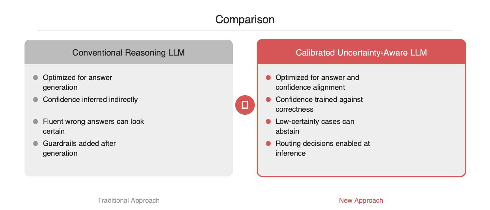

# LLM이 모르면 멈추게 하는 법, MIT의 신뢰도 캘리브레이션 접근

2026-04-27

## Summary

LLM 운영에서 까다로운 문제 중 하나는 모델이 틀린 답을 하면서도 확신에 찬 어조를 유지한다는 점입니다. MIT가 소개한 새 학습 방법은 이 지점을 직접 겨냥합니다. 목표는 정답률을 끌어올리는 것이 아니라, 모델의 자신감이 실제 정답 가능성과 맞물리도록 재학습하는 일입니다. 이 접근이 중요한 이유는 단순 품질 개선을 넘어, 저신뢰 응답을 검색·도구 호출·휴먼 리뷰로 안전하게 라우팅할 수 있게 만들기 때문입니다. 에이전트, RAG, 고위험 업무 자동화가 늘어나는 현재 시점에 실무적 의미가 큰 연구로 보입니다.

## 본문

### 핵심 요지

MIT News가 소개한 이번 연구의 초점은 **모델 성능 자체보다 신뢰도 추정의 정확성**에 있습니다. 문제는 많은 LLM이 답을 생성하는 능력과, 그 답이 맞을 가능성을 스스로 판단하는 능력이 분리되어 있지 않다는 점입니다. 그 결과 모델은 모를 때도 그럴듯한 문장으로 답을 이어가고, 운영 환경에서는 이것이 환각, 과신, 잘못된 자동화로 이어집니다.

이번 접근의 메시지는 단순합니다. **모델이 정답을 맞히는 것만 학습시키지 말고, 확신 수준도 실제 정답률에 맞게 학습시키자**는 것입니다. 즉, "아는 경우 자신 있게 답하고, 애매한 경우 불확실성을 표명하는" 행동을 목표 함수에 포함하는 방식입니다.

### 왜 기존 방식이 부족했는가

기존 LLM 파이프라인은 대체로 다음 목표에 최적화됩니다.

- 다음 토큰 예측 정확도
- 사람 선호 정렬
- 응답 유창성 및 일관성

하지만 이 목표들은 **캘리브레이션**과 동일하지 않습니다. 토큰 확률이 높다고 해서 최종 답변이 사실이라는 뜻은 아닙니다. 특히 추론형 모델에서는 중간 단계의 문장 생성이 길어질수록, 문장 유창성과 정답 가능성이 더 쉽게 분리됩니다.

실무에서 자주 쓰는 후처리 기법도 한계가 있습니다.

- softmax 점수 기반 confidence는 생성형 태스크에서 정답 가능성과 직접 연결되지 않는 경우가 많습니다.
- temperature scaling 같은 고전적 보정은 분류 문제에는 유효하지만, 자유 형식 생성과 장문 추론에는 적용이 까다롭습니다.
- self-consistency나 다중 샘플링은 비용을 올리지만, 모델이 일관되게 틀리는 경우에는 과신을 줄이지 못합니다.

결국 운영 리스크의 근본 원인은 **모델의 답변 품질**만이 아니라, **모델이 자기 확실성을 잘못 표현하는 구조**에 있습니다.

### 기술적 해결 원리

기사 설명을 기준으로 보면, MIT의 방법은 모델이 출력한 답의 정확도와 **자신감 추정치**를 더 잘 정렬하도록 학습시키는 방향입니다. 핵심은 다음 두 요소로 요약할 수 있습니다.

1. **정답 여부를 반영한 신뢰도 학습**입니다.  
모델은 단지 답을 생성하는 것이 아니라, 해당 답이 맞을 가능성도 함께 표현하도록 학습됩니다.

2. **성능 저하 없이 캘리브레이션 개선**입니다.  
기존에는 불확실성을 더 자주 말하게 만들면 답변 회피가 늘어 정답률이 떨어질 수 있었습니다. 이번 연구는 이 균형점을 개선하는 데 초점을 둔 것으로 보입니다.

개념적으로는 아래와 같은 학습 목표를 떠올리면 이해가 쉽습니다.

```text
Total Loss = Answer Loss + λ * Calibration Loss
```

- `Answer Loss`는 기존의 정답 생성 목적입니다.
- `Calibration Loss`는 모델의 confidence가 실제 정답률과 어긋나지 않도록 벌점을 주는 항목입니다.
- `λ`는 정확도와 캘리브레이션 사이의 균형을 맞추는 계수입니다.

즉, 모델이 틀릴 가능성이 높은 상황에서 높은 확신을 내면 더 큰 비용을 치르게 만드는 구조입니다. 이 방식은 "확신 있는 오답"을 줄이는 데 직접 작동합니다.

### 아키텍처 관점의 차이

기존 시스템은 보통 `질문 -> 생성 -> 후처리` 순서입니다. 반면 이번 접근은 학습 단계에서부터 불확실성 신호를 내재화한다는 점이 다릅니다.

- **기존 방식**: 생성 결과를 받은 뒤 heuristic이나 별도 검증기로 위험을 줄입니다.
- **새 방식**: 생성 모델 자체가 낮은 확실성을 더 정확하게 표현하도록 훈련합니다.

이 차이는 에이전트 시스템에서 의미가 큽니다. 후처리형 가드레일은 잘못된 답이 이미 생성된 뒤 차단하는 방식이지만, 캘리브레이션된 모델은 애초에 저신뢰 상황을 스스로 드러낼 수 있기 때문입니다.

### 실무 도입 포인트

이 연구가 실무에서 중요한 이유는 **confidence를 제어 신호로 사용할 수 있게 된다**는 점입니다. 예를 들면 다음과 같습니다.

- low confidence면 RAG 재조회 수행
- medium confidence면 툴 호출 또는 재추론 수행
- high confidence면 바로 응답 반환
- threshold 이하이면 휴먼 리뷰 큐로 전송

간단한 운영 패턴은 아래와 같습니다.

```python
def answer_with_guardrail(query):
    answer, confidence = model.generate(query, return_confidence=True)

    if confidence < 0.35:
        docs = retriever.search(query)
        answer, confidence = model.generate(
            query,
            context=docs,
            return_confidence=True,
        )

    if confidence < 0.20:
        return {
            "status": "needs_review",
            "answer": None,
            "confidence": confidence,
        }

    return {
        "status": "ok",
        "answer": answer,
        "confidence": confidence,
    }
```

이 패턴의 장점은 명확합니다.

- 환각을 0으로 만들지 못해도 **저신뢰 응답을 격리**할 수 있습니다.
- SLA와 비용 정책을 confidence threshold로 분기할 수 있습니다.
- 에이전트 워크플로우에서 재시도, 검색, 검증기를 조건부로 붙이기 쉬워집니다.





### 도입 시 주의점

다만 캘리브레이션이 만능은 아닙니다.

- confidence가 개선돼도 지식 공백 자체가 사라지는 것은 아닙니다.
- 도메인 이동이 크면 학습 시점의 보정이 운영 환경에서 깨질 수 있습니다.
- "모르겠습니다" 비율이 높아지면 사용자 경험과 처리량에 영향이 있을 수 있습니다.

따라서 실무에서는 정답률만이 아니라 다음 지표를 함께 봐야 합니다.

- ECE 같은 calibration 지표
- high-confidence error rate
- abstention rate
- fallback 이후의 최종 해결률

### 왜 지금 중요한가

최근 LLM은 단순 채팅을 넘어 검색, 코드 실행, 업무 자동화의 제어 계층으로 들어가고 있습니다. 이 단계에서는 "잘 답하는 모델"보다 "언제 틀릴 수 있는지 드러내는 모델"이 운영적으로 더 유용합니다. MIT의 이번 접근은 환각을 사후 검열하는 대신, **과신의 원인을 학습 단계에서 다루는 방향**이라는 점에서 의미가 있습니다.

엔지니어 관점에서 보면 핵심 질문은 하나입니다. **정답 생성 모델을 쓸 것인가, 아니면 정답 가능성까지 함께 보고하는 모델을 쓸 것인가**입니다. 프로덕션에서는 후자가 점점 기본값이 될 가능성이 높아 보입니다.

## References

- [https://news.mit.edu/2026/teaching-ai-models-to-say-im-not-sure-0422](https://news.mit.edu/2026/teaching-ai-models-to-say-im-not-sure-0422)
