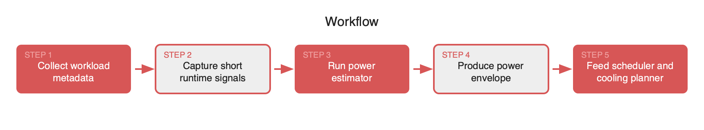
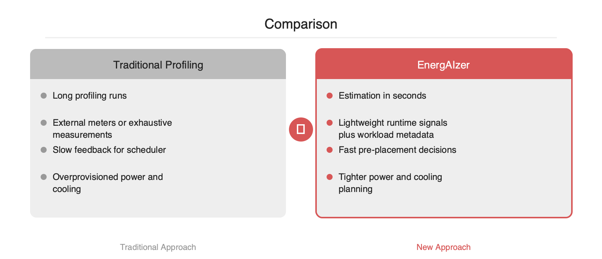

# 초 단위 AI 전력 추정, 스케줄러가 기다리지 않는 이유

2026-04-28

## Summary

LLM 서빙과 대규모 학습에서는 GPU 수보다 전력 예산이 먼저 병목이 되는 경우가 많습니다. 문제는 전력 소모가 모델 크기만으로 결정되지 않고, 배치 크기, 시퀀스 길이, 정밀도, 병렬화 방식, 메모리 병목에 따라 계속 달라진다는 점입니다. MIT의 EnergAIzer는 이런 변수를 빠르게 흡수해 AI 작업의 전력 사용량을 초 단위로 추정하는 접근입니다. 기사 설명대로라면 데이터센터 운영자는 긴 프로파일링이나 보수적 과잉 할당 없이 스케줄링, 랙 전력 계획, 냉각 운영을 더 빠르게 결정할 수 있습니다. 추론 워크로드 변동성이 커진 지금, 이런 추정기는 운영 시스템의 입력값으로 바로 연결될 만한 시점입니다.

## 본문

### 문제 배경

AI 인프라 운영에서 전력은 단순한 부대 비용이 아니라 배치와 스케줄링의 핵심 제약조건입니다. 같은 GPU라도 모델 종류, 토큰 길이, 배치 크기, 정밀도, 텐서 병렬 설정에 따라 소비 전력이 달라집니다. 그래서 정적 TDP 값만으로는 실제 운영 상황을 설명하기 어렵습니다.

기존 방식은 두 가지 한계가 있습니다. 첫째, 외부 전력계나 장시간 프로파일링은 정확하지만 느립니다. 둘째, 보수적인 상한값 기반 계획은 안전하지만 랙 전력과 냉각 용량을 과잉 예약하게 만듭니다. 이 비용은 곧바로 낮은 서버 밀도, 비효율적 bin-packing, 불필요한 탄소 배출로 이어집니다.

### EnergAIzer의 핵심

MIT News에 따르면 EnergAIzer는 AI 전력 사용량을 신뢰 가능한 수준으로 몇 초 안에 추정하는 방법입니다. 핵심 가치는 전력을 직접 오래 측정하는 대신, 짧은 관측과 워크로드 특성으로 빠르게 추정치를 만든다는 점입니다.

공개 기사 기준으로 세부 수식이나 피처 구성 전체가 드러나지는 않았지만, 엔지니어링 관점의 구조는 분명합니다.

- 입력: 모델 및 작업 구성 정보
- 관측: 짧은 실행 구간에서 얻는 런타임 신호
- 출력: 작업의 전력 사용량 추정치 또는 전력 구간

이 접근이 유효한 이유는 AI 워크로드의 전력 패턴이 완전히 무작위가 아니기 때문입니다. 연산 밀도, 메모리 접근 패턴, 배치 크기, 시퀀스 길이 같은 특성이 일정한 전력 시그니처를 만들기 때문입니다. EnergAIzer는 이 상관관계를 이용해 긴 실측을 짧은 추정으로 대체하는 방식으로 보입니다.

### 왜 지금 필요한가

2026년 시점의 AI 시스템은 추론 비중이 커지고 있고, 추론은 학습보다 변동성이 큰 경우가 많습니다. 같은 모델도 요청 길이와 동시성에 따라 GPU 전력 곡선이 달라집니다. 이때 전력 추정이 수 분 단위라면 오토스케일러나 스케줄러에는 늦습니다. 반대로 초 단위라면 다음 의사결정에 바로 투입할 수 있습니다.

- 사전 배치 전력 검증
- 랙 단위 power cap 준수 확인
- 냉각 장치 선제 제어
- 혼합 클러스터에서 작업 재배치
- 비용 및 탄소 보고 자동화





### 운영 시스템에 붙이는 방식

실무에서는 정확도 자체보다도 "언제 결과를 받을 수 있는가"가 중요합니다. 전력 예측이 스케줄러의 동기 경로에 들어가려면 수 초 이내 응답이 필요합니다. EnergAIzer는 이 조건을 충족하는 방향의 기술로 보입니다.

```python
# concept only
estimate = energaizer.predict(
    model="llama-70b",
    accelerator="H100",
    batch_size=8,
    seq_len=4096,
    precision="fp8",
    tensor_parallel=4,
    pipeline_parallel=2,
)

if rack.available_watts >= estimate.p95_watts:
    scheduler.place(job, rack)
else:
    scheduler.defer(job)
```

이런 형태로 연결하면 스케줄러는 GPU 메모리와 네트워크뿐 아니라 전력 여유도 함께 고려할 수 있습니다. 특히 동일 랙 내 고전력 작업이 동시에 몰리는 상황을 줄이는 데 유용합니다.





### 장점과 주의점

장점은 명확합니다. 긴 벤치마크 없이 빠르게 추정할 수 있고, 그 결과를 운영 자동화에 붙이기 쉽습니다. 데이터센터 운영자는 더 촘촘한 자원 배치와 냉각 계획을 시도할 수 있습니다.

다만 도입 시에는 몇 가지를 점검해야 합니다.

- 하드웨어 세대 변경 시 재보정 필요성
- 드라이버, 커널, 펌웨어 업데이트에 따른 드리프트
- MoE, sparse kernel, 커스텀 연산자 같은 예외 패턴
- 단일 추정치보다 신뢰구간 제공 여부

결국 좋은 전력 추정기는 숫자 하나를 맞히는 도구가 아니라, 스케줄러가 위험을 계산할 수 있게 만드는 도구입니다. MIT의 EnergAIzer가 보여주는 방향은 분명합니다. AI 전력 관리는 나중에 집계하는 관측 영역이 아니라, 배치 이전에 계산하는 제어 영역으로 이동하고 있습니다.

## References

- [https://news.mit.edu/2026/faster-way-to-estimate-ai-power-consumption-0427](https://news.mit.edu/2026/faster-way-to-estimate-ai-power-consumption-0427)
