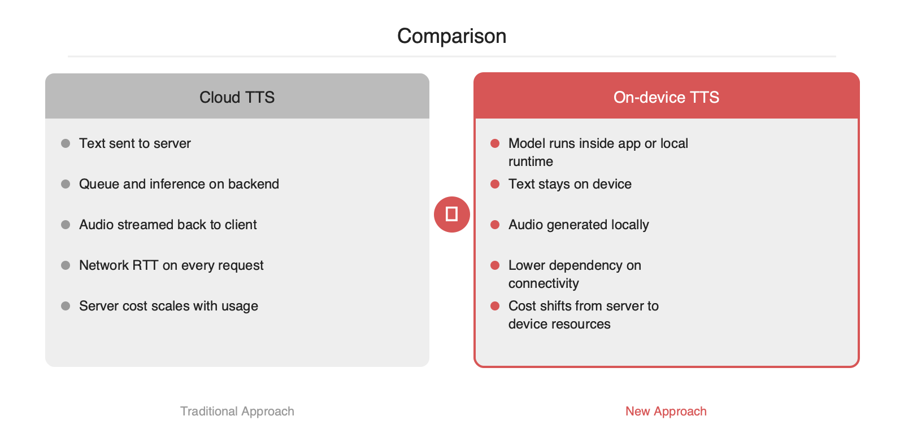

# 클라우드 TTS를 기기 안으로 옮기는 선택지, Neuphonic의 neutts

2026-04-30

## Summary

GitHub Trending에 오른 `neuphonic/neutts`는 Neuphonic이 공개한 온디바이스 TTS 모델 저장소입니다. 핵심은 텍스트를 서버로 보내 합성 오디오를 다시 내려받는 기존 구조를 줄이고, 음성 합성을 사용자 기기 내부에서 끝내는 방향입니다. 이 방식은 네트워크 왕복 지연과 오디오 전송 비용을 줄이고, 오프라인 동작과 개인정보 보호 요구에도 대응하기 쉽습니다. 모바일·엣지 추론 런타임이 성숙한 시점이라 제품 팀이 TTS를 기능이 아니라 시스템 설계 문제로 다시 볼 만한 흐름입니다.

## 본문

### 무엇이 문제였는가

클라우드 TTS는 구현이 단순하지만, 제품 단계로 가면 병목이 분명해집니다. 앱이 텍스트를 서버로 보내고, 서버가 합성한 오디오를 다시 내려주는 구조이기 때문입니다. 이 경로에는 네트워크 RTT, 서버 큐 대기, 합성 시간, 오디오 다운로드 시간이 순차적으로 붙습니다. 짧은 문장을 자주 읽어야 하는 UI, 에이전트 응답 스트리밍, 차량·로봇·웨어러블 같은 연결 불안정 환경에서는 이 비용이 사용자 경험을 직접 흔듭니다.

비용 구조도 문제입니다. 클라우드 TTS는 요청 수와 오디오 길이에 따라 추론 비용과 전송 비용이 함께 증가합니다. 기능이 붙을수록 단가를 감당해야 하므로, 음성 기능이 실험 단계에 머무르는 경우가 많습니다. 텍스트가 서버를 거친다는 점은 개인정보 처리와 규제 검토까지 동반합니다.

### neutts가 제시하는 방향

`neuphonic/neutts`는 저장소 설명 기준으로 Neuphonic의 온디바이스 TTS 모델입니다. 핵심 아이디어는 단순합니다. 텍스트를 기기 안에서 바로 음성 파형으로 변환해 서버 왕복을 제거하는 방식입니다. 서버는 모델 배포, 업데이트, 라이선스 관리, 선택적 품질 향상 역할로 뒤로 물러나고, 실제 합성 경로는 사용자 프로세스 안으로 들어옵니다.

이 구조가 주는 이점은 세 가지입니다.

- **지연 단축**: 텍스트 업로드와 오디오 다운로드가 사라져 첫 음성 출력까지의 경로가 짧아집니다.
- **비용 절감**: 호출당 서버 추론 비용과 오디오 전송 비용을 줄일 수 있습니다.
- **오프라인·프라이버시**: 네트워크가 없어도 동작 가능성이 생기고, 민감한 텍스트가 기기를 벗어나지 않는 설계가 가능합니다.

### 아키텍처 관점의 차이

기존 클라우드 TTS는 중앙 집중형입니다. 모델 버전 관리와 품질 통제가 쉽지만, 확장 비용과 네트워크 의존성이 큽니다. 반대로 온디바이스 TTS는 계산을 사용자 단말로 분산합니다. 서버 스케일 부담은 줄지만, 기기 성능 편차와 배터리·메모리 예산을 함께 다뤄야 합니다.

실무적으로는 다음 질문이 중요합니다.

1. **모델 크기와 메모리 상주 비용**이 앱 예산 안에 들어오는가입니다.
2. **실시간성**이 필요한가, 아니면 문장 단위 배치 합성으로 충분한가입니다.
3. **지원 플랫폼**이 iOS, Android, 데스크톱, 임베디드 중 어디까지 필요한가입니다.
4. **음질보다 가용성**이 중요한 사용 사례인가입니다.

저장소 설명만으로는 모델 크기, 지원 언어, 라이선스 범위, 런타임 백엔드 같은 세부 정보는 추가 확인이 필요합니다. 다만 GitHub Trending에 오른 이유는 분명합니다. TTS가 더 이상 서버 전용 기능이 아니라, 엣지 추론 최적화와 함께 애플리케이션 설계의 기본 옵션으로 이동하고 있기 때문입니다.

### 도입 시 기대 효과와 주의점

온디바이스 TTS는 특히 다음 시나리오에 적합합니다.

- 응답 지연이 제품 KPI에 직접 연결되는 음성 UI입니다.
- 연결이 불안정한 현장 장비, 차량, 키오스크입니다.
- 개인정보가 포함된 텍스트를 외부로 보내기 어려운 도메인입니다.
- 호출량이 커서 클라우드 단가가 기능 채택을 막는 서비스입니다.

반면 단점도 명확합니다.

- 저사양 기기에서는 합성 속도와 발열이 문제가 될 수 있습니다.
- 모델 업데이트가 앱 배포 전략과 결합됩니다.
- 기기별 오디오 스택 차이로 QA 범위가 넓어집니다.

### 적용 패턴

초기 도입은 전면 전환보다 **하이브리드 폴백**이 현실적입니다. 기본 경로는 온디바이스로 두고, 긴 문장이나 고품질 음색이 필요한 경우에만 서버 TTS로 우회하는 방식입니다. 이 패턴은 비용과 지연을 줄이면서도 품질 리스크를 통제하기 좋습니다.

```python
# Pseudo-code for hybrid TTS routing
text = get_response_text()

if device_has_model() and is_short_utterance(text) and battery_ok():
    audio = on_device_tts.synthesize(text)
else:
    audio = cloud_tts.synthesize(text)

play(audio)
```

온디바이스 TTS의 의미는 모델 하나가 추가됐다는 데 있지 않습니다. 음성 기능의 비용 구조를 바꾸고, 네트워크 상태와 무관한 UX를 설계할 수 있게 만든다는 데 있습니다. `neutts`는 그 흐름을 확인할 수 있는 저장소로 보입니다.





## References

- [https://github.com/neuphonic/neutts](https://github.com/neuphonic/neutts)
