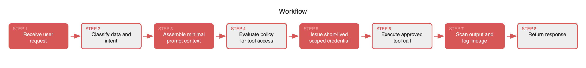
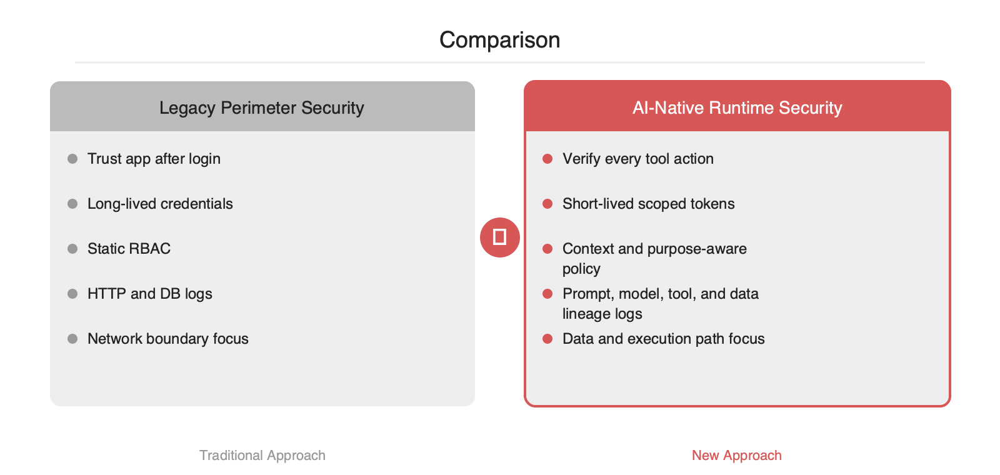

# AI가 공격면이 되는 순간, 보안 경계는 사라집니다

2026-05-05

## Summary

MIT Technology Review의 EmTech AI 세션은 AI를 기능 추가가 아니라 공격면 확장으로 봐야 한다는 점을 짚습니다. 기존 보안은 네트워크 경계, 정적 권한, 애플리케이션 단위 신뢰를 전제로 설계됐지만, LLM API·에이전트·프롬프트 컨텍스트·외부 도구 호출이 결합된 시스템에서는 이 전제가 빠르게 무너집니다. 이제 보안은 모델 앞단의 인증만으로 끝나지 않으며, 프롬프트 구성, 데이터 주입, 툴 실행, 응답 반환까지 요청 단위로 검증해야 합니다. AI 서비스를 운영하는 백엔드 팀이라면 보안을 별도 레이어가 아니라 런타임 제어면으로 다시 설계해야 하는 시점입니다.

## 본문

### 문제 정의

MIT Technology Review의 **Cyber-Insecurity in the AI Era**는 기존 보안 모델이 AI 스택에서 어디서 약해지는지를 구조적으로 보여주는 내용입니다. 핵심은 단순합니다. AI는 기존 시스템 위에 붙는 기능이 아니라, **새로운 입력 채널·의사결정 계층·외부 실행 경로**를 동시에 추가합니다. 이 변화는 공격면을 늘리고, 누가 무엇을 왜 호출했는지 추적하기 어렵게 만듭니다.

기존 애플리케이션에서는 사용자 인증, API 권한, DB 접근 통제 정도를 잘 설계하면 기본선은 맞출 수 있었습니다. 그러나 에이전트 시스템에서는 프롬프트에 어떤 컨텍스트가 들어갔는지, 모델이 어떤 도구를 어떤 파라미터로 호출했는지, 반환된 결과가 다시 어떤 시스템에 반영됐는지까지 검증해야 합니다. 보안의 단위가 **애플리케이션**에서 **요청·컨텍스트·행동**으로 쪼개지는 셈입니다.

### 왜 레거시 보안이 부족한가

문제의 원인은 세 가지로 정리됩니다.

1. **신뢰 경계의 붕괴**입니다. 내부 시스템이라도 프롬프트 주입, 검색 인덱스 오염, 툴 응답 변조를 통해 모델의 의사결정이 흔들릴 수 있습니다.
2. **권한 전파의 불투명성**입니다. 사용자는 읽기 권한만 가졌지만, 에이전트가 연결된 도구를 통해 쓰기 작업까지 수행할 수 있는 구조가 생깁니다.
3. **관측 가능성 부족**입니다. 기존 로그는 HTTP 요청과 SQL 쿼리 중심이지만, AI 워크플로에서는 프롬프트 조합, 모델 응답, 함수 호출, 외부 API 결과를 함께 봐야 사고 원인을 재구성할 수 있습니다.

즉, 네트워크 경계 보안과 장기 토큰 기반 권한 관리만으로는 부족합니다. 특히 MCP 스타일 도구 연결, RAG, 장기 메모리, 백그라운드 에이전트가 들어가면 보안 검토 범위가 한 단계 넓어집니다.

### 기술적 해결 원리

실무적으로는 다음 원칙이 필요합니다.

### 1) 사용자 권한과 에이전트 권한의 분리
에이전트는 사용자를 대신해 행동하지만, 사용자와 동일한 무제한 권한을 가져서는 안 됩니다. 각 툴 호출은 **사용자 ID + 세션 컨텍스트 + 작업 목적** 기준으로 다시 평가해야 합니다.

### 2) 컨텍스트 최소화
모델에 넣는 프롬프트와 검색 결과는 필요한 데이터만 포함해야 합니다. 민감정보, 운영 비밀, 타 테넌트 데이터는 프롬프트 조립 단계에서 마스킹하거나 제외해야 합니다.

### 3) 도구 호출의 세분화된 승인
"모델이 필요하면 호출한다"는 방식은 위험합니다. 툴마다 허용 메서드, 파라미터 스키마, 리소스 범위, 속도 제한을 둬야 합니다. 가능하면 **short-lived token**과 **scoped credential**을 사용해야 합니다.





### 4) 출력 검증과 사후 감사
모델 출력은 최종 결과물이 아니라 또 다른 입력일 수 있습니다. 따라서 외부 전송 전 DLP 검사, 명령 실행 전 정책 평가, 사고 분석용 추적 로그가 필요합니다.

### 아키텍처 관점의 재설계

기존 구조가 `User -> App -> DB/API`였다면, AI 구조는 `User -> Orchestrator -> Prompt Builder -> Model -> Tools/RAG/Memory -> Action`에 가깝습니다. 보안 제어도 이 경로를 따라 삽입해야 합니다.

- 인증은 진입점 1회가 아니라 **행동 단위 재검증**으로 이동합니다.
- 권한은 역할 기반 고정값보다 **세션·리소스·목적 기반 정책**으로 이동합니다.
- 로깅은 요청 로그에서 **추론 로그 + 도구 호출 로그 + 데이터 계보 로그**로 확장됩니다.
- 탐지는 시그니처 기반에서 **비정상 호출 패턴, 프롬프트 변형, 데이터 유출 시도** 탐지로 확장됩니다.





### 구현 예시

다음은 에이전트의 툴 호출 앞단에서 정책을 강제하는 단순한 예시입니다.

```ts
interface ToolRequest {
  userId: string;
  sessionId: string;
  tool: "crm.read" | "crm.write" | "slack.post";
  resourceId?: string;
  purpose: string;
  args: Record<string, unknown>;
}

async function authorizeToolCall(req: ToolRequest) {
  const decision = await policyEngine.evaluate({
    subject: req.userId,
    session: req.sessionId,
    action: req.tool,
    resource: req.resourceId,
    purpose: req.purpose,
    inputSchemaValid: validateArgs(req.tool, req.args)
  });

  if (!decision.allow) {
    throw new Error("tool call denied");
  }

  return issueScopedToken({
    tool: req.tool,
    ttlSeconds: 60,
    resource: req.resourceId
  });
}
```

핵심은 모델이 직접 자격증명을 오래 들고 있지 않게 만드는 점입니다. 오케스트레이터가 정책 엔진을 통해 매 호출을 심사하고, 짧은 수명의 범위 제한 토큰을 발급하는 방식이 기본형에 가깝습니다.

### 도입 시 장단점

장점은 분명합니다. 데이터 유출 범위를 줄이고, 에이전트 오작동을 권한 경계 안에 가둘 수 있으며, 사고 발생 시 원인 추적도 쉬워집니다. 반면 단점도 있습니다. 정책 평가와 로깅이 늘어나면서 지연 시간이 증가할 수 있고, 개발팀은 프롬프트 설계뿐 아니라 **정책 설계와 감사 설계**까지 함께 책임져야 합니다.

그럼에도 방향은 명확합니다. AI 시스템의 보안은 모델 자체를 막는 문제가 아니라, **모델이 어떤 데이터와 도구를 어떤 조건에서 사용할 수 있는지 제어하는 문제**입니다. 이 기사가 중요한 이유는, AI 시대의 보안을 별도 부가기능이 아니라 런타임 아키텍처의 중심 문제로 다시 보게 만든다는 점에 있습니다.

## References

- [https://www.technologyreview.com/2026/05/01/1136779/cyber-insecurity-in-the-ai-era/](https://www.technologyreview.com/2026/05/01/1136779/cyber-insecurity-in-the-ai-era/)
