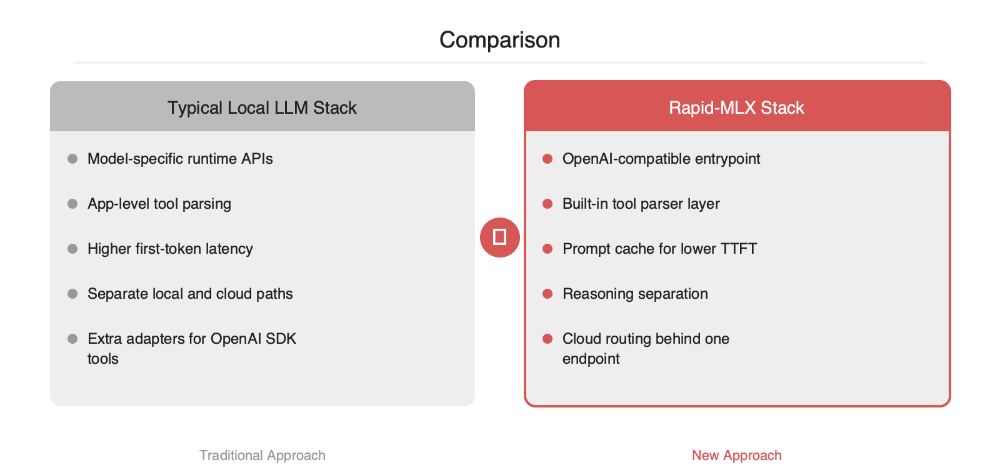

# Rapid-MLX: Apple Silicon 로컬 LLM을 OpenAI 대체 경로로 묶는 엔진

2026-05-05

## Summary

Mac에서 로컬 LLM을 붙일 때 병목은 단순한 토큰 속도가 아니라 첫 토큰 지연, 모델별 API 차이, 불완전한 툴 콜링, 그리고 클라우드·로컬 라우팅의 파편화에 있습니다. Rapid-MLX는 이 지점을 한 번에 겨냥합니다. GitHub 설명 기준으로 Ollama 대비 4.2배 빠른 처리, 캐시 적중 시 0.08초 TTFT, 17개 툴 파서, 100% 툴 콜링, OpenAI 호환 API를 제공합니다. Claude Code, Cursor, Aider 같은 기존 개발 도구를 거의 변경 없이 로컬 모델에 연결하려는 팀이라면, 성능 최적화보다 먼저 인터페이스 표준화를 어떻게 설계할지 보여주는 사례로 읽을 만한 프로젝트입니다.

## 본문

### 문제 정의

Mac에서 로컬 LLM을 실무에 붙일 때 체감 병목은 세 가지로 수렴합니다. 첫째는 TTFT입니다. 토큰 생성 속도가 높아도 첫 응답이 늦으면 IDE 보조, 에이전트 루프, 코드 편집 워크플로우에서는 지연이 누적됩니다. 둘째는 API 호환성입니다. 로컬 런타임마다 엔드포인트와 파라미터가 달라 OpenAI SDK를 그대로 쓰기 어렵습니다. 셋째는 툴 콜링입니다. 모델마다 함수 호출 포맷이 달라 파서와 검증 로직이 애플리케이션 계층으로 새어 나옵니다.

Rapid-MLX는 이 세 가지를 엔진 계층에서 흡수하는 설계를 내세웁니다. 프로젝트 설명 기준 핵심 수치는 Ollama 대비 4.2배 빠른 처리, 캐시된 요청의 TTFT 0.08초, 17개 툴 파서, 100% 툴 콜링, OpenAI 드롭인 대체입니다.

### 기존 방식이 불충분한 이유

일반적인 로컬 LLM 스택은 `모델 런타임 + 얇은 HTTP 서버 + 앱별 파서` 조합입니다. 이 구조에서는 성능 최적화와 인터페이스 표준화가 분리됩니다. 예를 들어 추론 자체는 로컬에서 돌리더라도, 툴 콜 결과를 안정적으로 재현하려면 모델별 출력 포맷을 다시 맞춰야 합니다. Claude Code, Cursor, Aider 같은 도구와 연결할 때도 OpenAI 호환이 완전하지 않으면 프록시 계층을 추가해야 합니다.

이때 운영 복잡도는 두 방향으로 커집니다. 애플리케이션 팀은 모델별 예외 처리를 코드에 넣게 되고, 플랫폼 팀은 로컬과 클라우드 모델을 서로 다른 규약으로 운영하게 됩니다. 결국 병목은 GPU나 NPU가 아니라 인터페이스 불일치에서 발생합니다.

### Rapid-MLX의 해결 원리

Rapid-MLX가 제시하는 해법은 로컬 추론 엔진을 OpenAI 호환 게이트웨이처럼 다루는 방식입니다.

### 1) Prompt cache 기반 TTFT 단축

설명에 따르면 캐시 적중 시 TTFT가 0.08초입니다. 이는 IDE 보조나 반복 프롬프트가 많은 에이전트 워크로드에서 효과가 큽니다. 시스템 프롬프트, 툴 스키마, 반복되는 컨텍스트가 자주 재사용되는 환경일수록 캐시 계층의 가치가 커집니다.

### 2) Tool parser 추상화

17개 툴 파서를 제공한다는 점은 단순 기능 추가가 아니라 호환성 레이어에 가깝습니다. 모델마다 서로 다른 함수 호출 표현을 공통 인터페이스로 정규화하면, 애플리케이션은 특정 모델의 JSON 흔들림이나 포맷 편차를 직접 감당하지 않아도 됩니다. 프로젝트가 100% 툴 콜링을 전면에 내세우는 이유도 여기에 있습니다.

### 3) Reasoning separation

설명에 포함된 reasoning separation은 추론 과정과 최종 응답을 분리해 다루는 계층으로 해석할 수 있습니다. 이는 체인 오브 소트 노출 통제, 로그 저장 범위 관리, 툴 실행 전후 메시지 정제 같은 운영 요구와 맞닿아 있습니다. 에이전트 시스템에서는 정답 품질뿐 아니라 관찰 가능성과 데이터 경계가 중요하기 때문입니다.

### 4) Cloud routing

로컬 우선 전략을 유지하되, 모델 부재나 품질 요구가 높을 때 클라우드로 우회하는 구성이 가능합니다. 이 구조는 개발자 경험 측면에서 의미가 있습니다. 상위 애플리케이션은 단일 OpenAI 호환 엔드포인트만 바라보고, 실제 실행 위치는 라우팅 계층이 결정하는 방식입니다.

### 아키텍처 관점의 차이

기존 스택은 추론 엔진을 직접 노출하는 경우가 많습니다. Rapid-MLX가 지향하는 방향은 추론 엔진을 표준 API 뒤에 숨기고, 성능 기능과 호환성 기능을 같은 계층에 배치하는 방식입니다. 이 설계는 특히 멀티도구 에이전트와 IDE 연동에서 유리합니다.

```python
from openai import OpenAI

client = OpenAI(
    base_url="http://localhost:8080/v1",
    api_key="local"
)

resp = client.chat.completions.create(
    model="local-model",
    messages=[
        {"role": "system", "content": "You are a coding assistant."},
        {"role": "user", "content": "Summarize this diff and propose tests."}
    ],
    tools=[
        {
            "type": "function",
            "function": {
                "name": "run_tests",
                "description": "Run selected test targets",
                "parameters": {
                    "type": "object",
                    "properties": {
                        "targets": {"type": "array", "items": {"type": "string"}}
                    },
                    "required": ["targets"]
                }
            }
        }
    ]
)
```

위와 같은 방식이 성립하면 기존 OpenAI SDK 기반 코드의 변경 범위는 `base_url` 수준으로 축소됩니다. 실무에서는 이 점이 토큰 속도 수치만큼 중요합니다.





### 도입 시 장단점

### 장점

- Apple Silicon 환경에서 로컬 우선 아키텍처를 구성하기 쉽습니다.
- OpenAI 호환으로 기존 SDK, 에이전트 프레임워크, 개발 도구 연결 비용을 줄일 수 있습니다.
- 툴 콜링 파서가 엔진에 내장되면 앱 계층의 예외 처리가 단순해집니다.
- 클라우드 라우팅으로 로컬과 원격 모델을 단일 진입점 아래 묶을 수 있습니다.

### 점검 포인트

- 성능 수치는 워크로드, 모델 크기, 프롬프트 길이, 캐시 적중률에 따라 달라질 수 있습니다.
- OpenAI 호환이라도 세부 파라미터와 스트리밍 동작은 실제 통합 테스트가 필요합니다.
- 툴 콜링 100%라는 표현은 지원 범위와 검증 조건을 함께 확인하는 것이 적절합니다.

### 왜 지금 볼 가치가 있는가

로컬 LLM 도입의 다음 단계는 단순 실행이 아니라 운영 표준화입니다. Rapid-MLX는 Apple Silicon에서 빠르게 돌리는 문제와, 그 결과를 기존 OpenAI 생태계에 무리 없이 연결하는 문제를 함께 다룹니다. 성능 엔진이면서 동시에 호환성 게이트웨이로 보인다는 점에서, Mac 기반 AI 개발 환경을 설계하는 팀에게 참고할 만한 사례입니다.

## References

- [https://github.com/raullenchai/Rapid-MLX](https://github.com/raullenchai/Rapid-MLX)
