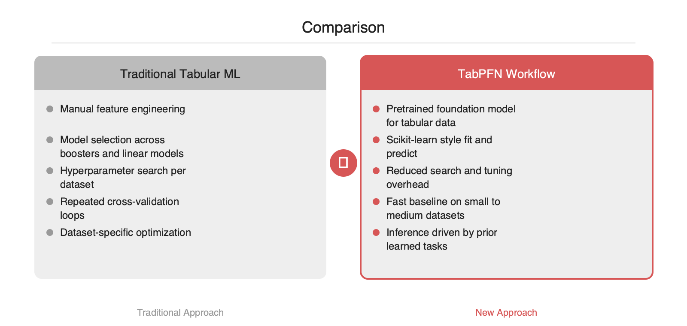

# 탭ুল러 ML의 기본값 재정의, PriorLabs TabPFN

2026-05-06

## Summary

TabPFN은 탭ুল러 데이터를 위해 사전학습된 파운데이션 모델을 앞세워, 전통적인 AutoML·부스팅·피처 엔지니어링 중심 워크플로를 다시 묻게 만드는 프로젝트입니다. 핵심은 개별 데이터셋마다 모델 탐색을 반복하는 대신, 대규모 사전학습으로 축적한 추론 능력을 바로 적용한다는 점입니다. 표 데이터가 여전히 기업 시스템의 중심에 있다는 점, 그리고 LLM 이후 파운데이션 모델 패턴이 비정형을 넘어 구조화 데이터로 확장되고 있다는 점에서 지금 주목할 이유가 분명합니다.

## 본문

### 문제 배경

현업의 탭ুল러 모델링은 여전히 반복 비용이 큰 작업입니다. 데이터셋이 바뀔 때마다 XGBoost, LightGBM, CatBoost, 랜덤포레스트, 로지스틱 회귀 같은 후보를 비교하고, 결측치 처리와 범주형 인코딩을 손보고, 교차검증으로 하이퍼파라미터를 다시 탐색하는 과정이 필요합니다. 이 방식은 안정적이지만, 작은 데이터셋이 많고 실험 회전이 잦은 조직일수록 엔지니어링 비용이 빠르게 커집니다.

TabPFN이 겨냥하는 지점은 이 반복입니다. 이 프로젝트는 탭ुल러 데이터 모델링을 데이터셋별 최적화 문제에서, 사전학습된 모델을 불러와 바로 추론하는 문제로 옮기려는 접근입니다.

### 작동 원리

TabPFN의 핵심 아이디어는 탭ুল러 데이터용 파운데이션 모델입니다. 알려진 방식은 다음과 같습니다.

1. 다양한 합성 태스크와 사전 분포 위에서 모델을 대규모로 사전학습합니다.
2. 이 과정에서 모델은 탭ুল러 분류·회귀 문제에서 자주 등장하는 패턴을 내재화합니다.
3. 추론 시점에는 개별 데이터셋에 대해 긴 하이퍼파라미터 탐색 대신, 학습 데이터와 예측할 샘플을 조건으로 넣어 결과를 산출합니다.

이 접근은 전통적인 트리 부스팅과 다릅니다. 부스팅 계열은 각 데이터셋에서 손실을 줄이도록 모델을 새로 최적화합니다. 반면 TabPFN은 사전학습 단계에서 이미 광범위한 태스크 분포를 학습해 두고, 실제 사용 시에는 그 지식을 가져와 적용하는 구조입니다. 개념적으로는 "탭ुल러 데이터에 대한 사전학습된 추론기"에 가깝습니다.

### 엔지니어 관점의 차이

### 기존 워크플로
- 데이터 정제
- 인코딩·스케일링·피처 생성
- 여러 모델 후보 비교
- 하이퍼파라미터 탐색
- 교차검증 반복

### TabPFN 중심 워크플로
- 데이터 정제
- 최소한의 스키마 확인
- 사전학습 모델 호출
- 필요 시 앙상블·보정·후처리 추가

핵심 차이는 최적화의 위치입니다. 기존 방식은 프로젝트마다 최적화를 다시 수행합니다. TabPFN은 그 비용 일부를 사전학습으로 선반영합니다. 따라서 작은 데이터셋을 자주 다루는 팀, 빠른 베이스라인이 중요한 팀, 모델 선택 비용이 병목인 조직에서 특히 의미가 있습니다.

### 빠른 사용 예시

```python
from tabpfn import TabPFNClassifier
from sklearn.model_selection import train_test_split
from sklearn.metrics import accuracy_score

X_train, X_test, y_train, y_test = train_test_split(X, y, test_size=0.2, random_state=42)

clf = TabPFNClassifier()
clf.fit(X_train, y_train)
pred = clf.predict(X_test)

print(accuracy_score(y_test, pred))
```

코드 형태만 보면 scikit-learn 스타일 추정기와 유사합니다. 이 점은 실무 도입 장벽을 낮추는 요소입니다. 기존 파이프라인, 평가 코드, 서빙 래퍼에 비교적 쉽게 연결할 수 있습니다.





### 장점

### 1. 베이스라인 확보 시간 단축
모델 선택과 탐색 비용을 줄여 초기 성능 확인을 빠르게 할 수 있습니다. PoC 단계나 데이터 제품의 초기 가설 검증에서 유용합니다.

### 2. 작은 표 데이터에서의 실용성
TabPFN은 특히 작은 규모의 탭ुल러 문제에서 자주 언급됩니다. 표 데이터 문제는 샘플 수가 제한적인 경우가 많기 때문에, 사전학습된 귀납 편향이 도움이 될 여지가 있습니다.

### 3. 파이프라인 단순화
피처 엔지니어링과 모델 탐색을 완전히 제거하지는 못하더라도, 반복 폭을 줄이는 방향으로 작동합니다. 이는 MLOps 측면에서 실험 관리 복잡도를 낮출 수 있습니다.

### 한계와 도입 체크포인트

### 1. 모든 탭ुल러 문제의 대체재는 아님
대규모 데이터셋, 강한 도메인 피처가 필요한 문제, 제약이 복잡한 운영 환경에서는 여전히 부스팅 계열이나 도메인 맞춤형 파이프라인이 유리할 수 있습니다. 따라서 TabPFN은 만능 해법보다는 강력한 기본값 후보로 보는 편이 타당합니다.

### 2. 데이터 품질 문제는 그대로 남음
누수, 잘못된 라벨, 시계열 분할 오류, 고카디널리티 ID 컬럼, 비즈니스 규칙 위반 같은 문제는 모델이 대신 해결하지 못합니다. 피처 엔지니어링 부담은 줄어들 수 있지만 데이터 엔지니어링의 중요성은 줄지 않습니다.

### 3. 리소스와 추론 특성 점검 필요
파운데이션 모델 계열인 만큼 CPU/GPU 사용량, 배치 크기, 데이터셋 크기에 따른 지연 시간을 실제 환경에서 측정해야 합니다. 백엔드 팀이라면 온라인 추론보다는 비동기 스코어링이나 배치 추론이 더 적합한지 함께 판단해야 합니다.

### 왜 지금 봐야 하는가

LLM 이후 소프트웨어 업계는 "사전학습된 범용 모델 + 얇은 태스크 적응"이라는 패턴에 익숙해졌습니다. TabPFN은 이 패턴이 텍스트와 이미지 밖으로 확장될 수 있음을 보여주는 사례입니다. 특히 기업 데이터의 상당수는 여전히 관계형 테이블과 CSV, 피처 스토어에 머물러 있습니다. 그런 점에서 TabPFN은 탭ուլ러 ML을 AutoML의 연장선이 아니라 파운데이션 모델의 연장선에서 다시 보게 만드는 선택지입니다.

실무적으로는 하나의 질문으로 정리할 수 있습니다. "이 데이터셋에서 다시 탐색을 시작할 것인가, 아니면 이미 학습된 탭ुल러 추론기를 먼저 호출할 것인가"입니다. TabPFN이 주는 가치는 바로 이 질문의 기본값을 바꾼다는 데 있습니다.

## References

- [https://github.com/PriorLabs/TabPFN](https://github.com/PriorLabs/TabPFN)
